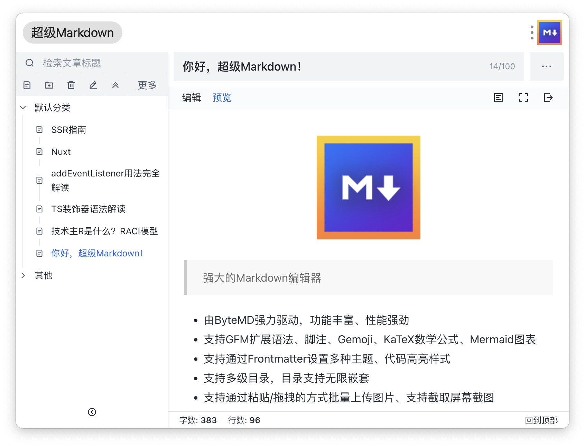

# SuperMarkdown

[⭐️ 主页 | WebSite](https://ziuchen.github.io/project/Markdown/)
[🕶️ 在线体验 | Online](https://ziuchen.github.io/Markdown/)
[🚚 更新日志 | Changelog](https://ziuchen.github.io/project/Markdown/log/)

- ✅ Powered by ByteMD, rich in functions and powerful in performance
- ✅ Supports GFM extended syntax, footnotes, Gemoji, KaTeX math formulas, Mermaid diagrams
- ✅ Setting multiple themes and code highlighting styles through Frontmatter
- ✅ Multi-level directories, directories support unlimited nesting
- ✅ Uploading pictures in batches by pasting/drag and drop, and support taking screenshots
- ✅ Batch import and export of Markdown files
- ✅ Multiple plug-ins, edit/refer to multiple articles at the same time
- ✅ Real-time synchronous preview and automatic saving

